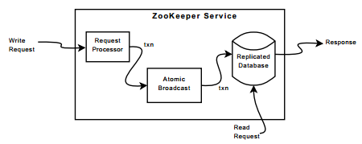

# [ZooKeeper: wait-free coordination for internet-scale systems](https://dl.acm.org/citation.cfm?id=1855851) 论文阅读笔记

> 有些表述绕来绕去，似乎也没什么内容   
> 个人感觉就2点：
> 
> - leader 把写请求转换成幂等的写事务
> - leader 广播写事务的通道是 FIFO 的

## 特征

- client 请求（大多是读）
  - 对同一 client 的请求是 FIFO 执行的
  - 写请求由 leader 串行执行（ZAB协议）
  - 读请求可以向任何 server，对 client 满足 时间戳一致性（读到的 server 保证自己的时间戳不小于 client）
- 协调原语
  - zookeeper 是一个 协调内核（coordination kernel），提供 API 给 dev，用来设计 协调原语（coordination primitive）
  - 不提供 lock

## Zookeeper 服务

- zookeeper 内存中的数据结点叫做 znode
- znode 结构上类似 linux 文件系统；所有 znode 都存储数据；除了 ephemeral znode，都可以有孩子节点
- client 与 zookeeper 的连接建立在 session 之上
  - session 有 timeout
  - zk 支持 client 将一个 session 透明地在 server 间转移
- zookeeper 向 client 提供一个抽象的 znode 集合
  - client 可以创建 znode
      - regular：永久性的，可以删除
      - ephemeral：生命周期在本次 session 之内，也可能 session 结束之前被 client 删除
- zookeeper 提供 watch 和 notify 服务（session 内的一次性触发服务）

**znodes 通常不用来存储数据，而是用来维护应用程序的 metadata**，说白了就是“**应用程序使用 zk 来管理配置文件**”

### API

- 读
  - 返回是否存在
  - 返回数据
  - 返回 children
  - 支持 watch 与 notify
- 写
  - 基于 version number 的 CAS
- 同步
  - 同步在此之前的 leader 上的所有写操作（主要用在读 server 前）

对 znode 的操作总是用 *绝对路径*，减少 server 的维护负荷

### 序保证

- 所有写操作都在 leader 串行化执行
- client 的 request 被 FIFO 执行

举了几个例子，就是如何用 zk 做通信与同步（之前看了些分布式全局快照，这里就没什么意思了）

- 使用 ephemeral node 来维护一群 server 的状态，每个 server 在自己的 session 建立 ephemeral node，整个集群的状态就在一个 subtree 下
- 用 file 的存在与否来模拟互斥锁，watch 这个 file 来得知锁被释放（惊群效应）
- 给要用锁的 server 编号，每次编号最小的拿锁，避免惊群效应（这里每个 server 都有自己的文件，编号最小视为拿锁，删除文件视为释放锁）
  - client 一上来先建个文件，并获得编号
  - 如果自己的编号是最小的，那么直接返回（视为 lock 成功）
  - 每个 client 都 **watch 编号比自己小1的**（避免惊群）
  - 释放锁的时候删除文件
- 读写锁：文件命名区分，写锁流程照常，读锁只要没有编号比自己小的写锁就成功

## Zookeeper 实现

- Request Processor
  - leader 广播的写事务是 ***idempotent***
  - 原文：*When the leader receives a write request, it calculates what the state of the system will be when the write is applied and transforms it into a transaction that captures this new state.*
  - 我猜应该是 leader 把所有写操作转换为写具体值。比如 `update x = x +1` 转换成 `update x = x0`，这样写事务就是幂等的了，之后只要保证 FIFO 执行
- Atomic Broadcast
  - leader 广播写操作到 server，保证通道是 **FIFO**
  - 新 leader 广播之前，保证收到了之前 leader 的所有广播
- Replicated Database
  - 每个 server 都有 replicated database (in memory)，使用 WAL 和 定期snapshot 回放
  - snapshot 生成时深度优先遍历 znode，**不上锁**
      - snapshot 的状态可能不存在：记录了生成 snapshot 开始之后的写事务，但由于写事务是幂等的，所以回放的时候不影响
- client 交互
  - 读请求附带时间戳 zxid
      - 如果 server 本地时间戳不小于读请求，那么可以直接本地读，不一定读到最新数据，但是性能高
      - 如果 client 要求最新数据，可以先 sync，然后 read（保证同步到 sync 为止新的数据）
  - session timeout
      - 在空闲期，client 在 timeout/3 处发送 heartbeat 给 server，如果之后的 timeout*2/3 没有收到回复，那么就换 server

## Reference

- [论文研读之ZooKeeper](https://oven-yang.github.io/%E8%AE%BA%E6%96%87%E7%A0%94%E8%AF%BB/paper-zookeeper/)
- [论文研读之Zab协议](https://oven-yang.github.io/%E8%AE%BA%E6%96%87%E7%A0%94%E8%AF%BB/paper-zab/)
- [ZooKeeper: Wait-free coordination for Internet-scale systems（笔记）](https://www.jianshu.com/p/73556607b828)